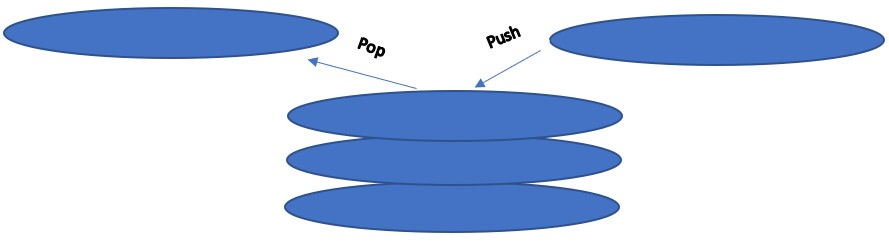

# Stack
Stack are easy to remember. The follow the "Last in, First out" (LIFO) method. Does that confuse you? Lets break it down more.

## Think about your Childhood
You come home from school and all you want to do is relax. That last a whole five minutes then you hear your mom yelling your name to unload the dishwasher full of plates. Think of the empty cabinet as an empty stack. You grab the first plate and you begin to build the stack. Each time you add a plate onto the stack that is called a **push** operation. Lucky you there was only five plates to push on the stack however, it took you long it is time for dinner and you guessed it you have to set the table with those five plates. What is the smart decision, grab the first plate you put away or the last plate you put away? If you guessed the last plate you are correct. If you did not guess that go read the stack introduction again. When you remove the plate from the stack this is called a **pop** operation. Soon you removed all the plates and now you are left with that empty stack again. 



## Stack in Python
### 1. Creating a Stack
Stacks in python are created using a python list. A list can grow and shrink as the stack does. To create a list simply give it a name and create an empty list using `[]`.
```python
stack = []
```
### 2. Removing from a Stack
With Stack you only want to remove from the end. You can either remove the item with a simple pop command or save the value to a variable
```python
#Removing Item
stack.pop()
#Removing and Saving Item
value = stack.pop()
```
### 3. Adding to a Stack
When adding to a stack you only want to add to the back of the stack. This is done with a simple push command. 
```python
stack.append(value)
```
### 4. Check if the Stack is empty
There are cases where you want to know if the stack is empty or not. This is solved with an `if` statement.
```python
if len(stack) == 0:
```
## Performance
Why stacks are so useful and used today is because of how fast they can perform. All up above operations are done in O(1) performance.
## Usage
Using stacks can help speed up your program however, just like everything in this world stacks have their time and place to be used. If you need to keep track of history or ever need to reverse something stack is the way to go. However, stacks can only remove and add to the end of a list. What if you wanted to remove something from the middle? Or add something to the very beginning? Well a stack would not work. You would need to find a different solution. 
## Example
Like mention up above stacks are very useful for keeping track of History. Say you have four players playing a game and you want to keep track of who has went. And in round four the game is switch and most be played in reverse order.
```python
#Create a blank stack
stack = []
#ROUND 1
#Player1 used his turn
stack.append("player1")
#Player2 used his turn
stack.append("player2")
#Player3 used his turn
stack.append("player3")
#Player4 used his turn
stack.append("player4")
#ROUND 2
#Player1 used his turn
stack.append("player1")
#Player2 used his turn
stack.append("player2")
#Player3 used his turn
stack.append("player3")
#Player4 used his turn
stack.append("player4")
#ROUND 3
#Player1 used his turn
stack.append("player1")
#Player2 used his turn
stack.append("player2")
#Player3 used his turn
stack.append("player3")
#Player4 used his turn
stack.append("player4")
#Here you can see who all went
print(stack)
#ROUND 4
#Several turns have gone by 
stack.pop()
stack.pop()
stack.pop()
stack.pop()
stack.pop()
#Now you can see who is up next
print(stack) #Expected turn to be Player3
```

## Problem to Solve:
Now you try! Lets pretend you are working for Microsoft and they are coming up with this new program called Microsoft Word. They want to implement a way to keep track of what is typed and how to undo what is typed. How would you solve this problem? Try your way then check my solution. 

### Starter Code:
```python
def add(sentence):
    stack = []
    #Add all the characters to the stack from the sentence
    return stack

def undo(stack):
    #If the stack is empty do nothing else
    #remove the last item from the stack
    pass
    


#Test Cases
#Test 1
#Take a sentence and add to the stack
print("TEST 1")
sentence = "This is a test sentence"
stack = add(sentence)
print(stack) #Expected outcome ['T', 'h', 'i', 's', ' ', 'i', 's', ' ', 'a', ' ', 't', 'e', 's', 't', ' ', 's', 'e', 'n', 't', 'e', 'n', 'c', 'e']
print("---------------")
print()

#Test 2
#The user wants to undo several characters and is left
#with the new sentence
print("TEST 2")
sentence = "This is a test sentence"
stack = add(sentence)
undo(stack)
undo(stack)
undo(stack)
undo(stack)
undo(stack)
undo(stack)
print(stack) #Expected outcome ['T', 'h', 'i', 's', ' ', 'i', 's', ' ', 'a', ' ', 't', 'e', 's', 't', ' ', 's', 'e']
print("---------------")
print()

#Test 3
#Create a test scenario for when the user tries to undo from an empty stack
print("TEST 3")
```
### Solution: 
[Stack Solution](Python/stack_prove.py)
