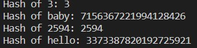
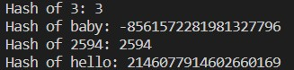

# Set
If you do not care about order or duplication you came to the right page because Sets do not care about any of those. Sets use a special technique called **hashing**. A set is kind of like a **sparse list**. Meaning there is only one place a value can go inside the set. This is also why sets do not care about duplicates because there is only one spot. 

## Hashing
Hashing is an important tool with sets. Its like meat a potatoes, you can not have one with out the other. Python has a built in hash function to be used. Hashing is a special algorithm that converts non integer numbers into integers for the set to work on anything. 
```python
print(f"Hash of 3: {hash(3)}")
print(f"Hash of baby: {hash('baby')}")
print(f"Hash of 2594: {hash(2594)}")
print(f"Hash of hello: {hash('hello')}")
```
This code would result in:



Or the code can result in this:



Notice the string hashes changed between the two pictures. This is because the python `hash()` function will return a different value every time the code is ran. However it will stay consistent throughout the whole code. 

## Set in Python
### 1. Creating a Set
There are two ways to create a set in python:
```python
my_set = set() #This will create an empty set called "my_set"

#You can also create a set with values in the set
my_set = {1,2,3}
```
### 2. Adding to a Set
To add to a set you call the set name and use the `add()` function.
```Python
my_set.add(value) #This will add the value to the set
```
### 3. Removing from a Set
To remove from a set you call the set name and use the `remove()` function. 
```Python
my_set.remove(value) #This will remove the value from the set
```
### 4. Finding a Value
To find a specific value in a set we use a `if` and `in` operator.
```Python
if value in my_set: #This will check to see if the value is in the set
```
### 5. Finding the Size of the Set
To return the size of the set we use the `len()` function.
```Python
size = len(my_set) #This will determine how many items are in the set and save that value to the variable size
```
### 6. Mathematical operations
We can use sets to find the intersections (common values between two sets) and the union (combine all values in two sets).
```Python
my_set1 = {1,2,3}
my_set2 = {2,3,4}

#Find the intersection
my_set3 = intersection(my_set1, my_set2) #Returns {2,3}
#OR another way to write the function is:
my_set3 = my_set1 & my_set2 #Returns {2,3}

#Find the Union
my_set3 = union(my_set1, my_set2) #Returns {1,2,3,4}
#OR another way to write the function is:
my_set3 = my_set1 | my_set2 #Returns {1,2,3,4}
```
## Performance and Usage
The reason sets are so powerful because of their fast performance. The above operations can all be done in O(1) performance. This allows the user to create a set where they can look up a value, find unique results, and perform mathematical operations quickly and efficiently.

## Conflicts
Just like most data structure there is at least one issue. For sets it is conflicts. Because of the way to determine the indexes it is possible to have two unique values that should go to the same index. Their are two strategies to solve for this issue. **Open addressing** where when a conflict occurs it tries to move the value to the right until it finds a free space. Or **chaining** which creates a new list for that index for everything that goes into that index. These conflicts hurt the performance taking the set from O(1) to O(n).

## Example
Say you are a teacher and you asked your students to write down their five favorite candies are. You want to create a program that will combine everyone's list and remove any repeating candy. Here is one way to solve this problem
```python
#List of five students favorite candies
student1 = ["Jolly Rancher", "Hershey", "Payday", "Sugar Daddy", "Pop Rock"]
student2 = ["Nerds", "Jawbreakers", "Salt Water Taffy", "Hershey", "Smarties"]
student3 = ["Milk Duds", "Smarties", "Nerds", "Blow Pop", "Starburst"]
student4 = ["Sugar Daddy", "Salt Water Taffy", "Junior Mints", "Jolly Rancher", "Pop Rock"]
student5 = ["Smarties", "Hershey", "Payday", "Blow Pop", "Nerds"]

#Put each student into a set
s1 = set(student1)
s2 = set(student2)
s3 = set(student3)
s4 = set(student4)
s5 = set(student5)

#Combine all into one set
combine_set = s1 | s2 | s3 | s4 | s5
print(combine_set) #Expected: {'Jolly Rancher', 'Salt Water Taffy', 'Starburst', 'Pop Rock', 'Smarties', 'Payday', 'Jawbreakers', 'Nerds', 'Blow Pop', 'Sugar Daddy', 'Hershey', 'Milk Duds', 'Junior Mints'}
```
## Problem to Solve
Here is your mission if you choose to accept it. You have a two list of many different names. These names all used their key card to get into a building on Tuesday January 14th. Some used the front door and others used the back door. I need you to get rid of all the same people in the list and find where the two sets intersects with each other. So we can determine all the suspects. Here is some help: 
```python
#Create a function that will get rid of duplicates
def create_set(list):
    #Create an empty set
    
    #Add each name in the list to the set
    
    #Return the new set
    pass

#Create a function that will find intersection
def intersection(set1, set2):
    pass

#Test
front_door = ["James", "Frank", "Karen", "Raymond", "Dave", "Linda", "Matt", "Mathew", "Mark", "Luke", "Skywalker", "Stephanie", "Dave", "Fred", "Paul", "Raymond"]
back_door = ["Frankie", "Marco", "Frankie", "Jason", "Bob", "Mike", "Frankie", "Curtis", "Daisy", "Frankie", "Linda", "Karen", "Karen", "Ted", "Barney", "Ross"]
front_door_set = create_set(front_door)
back_door_set = create_set(back_door)
print(intersection(front_door_set, back_door_set)) #Expected: {'Karen', 'Linda'}
```
## Solution
[Set Solution](Python/set_prove.py)