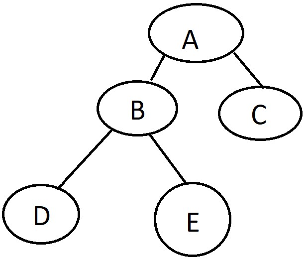

# Tree
Trees are a powerful type of list in coding. They are very similar to a link list however in a tree there can be multiple connections between nodes. We will only be dealing with 
**Binary Trees** where the max connection between nodes are two. 

## Structure of Binary Tree
The top of the tree is called the root. That is where the tree will start to branch off like a pyramid. In the picture below this would be the **A** value. Leafs are the nodes that have nothing connecting to them. Leafs in the pictures would be **D** and **E**. Then Binary Trees have a parent and a child node. A child is connected to a parent. And a parent is a node connected to another node. For example **B** is the parent while **D** and **E** are the child. 

## Tree in Python
Most operations involving trees uses recursion. This being said functions are needed to preform the operations.

### 1. Inserting
The first operation is inserting into a tree. THe insert function will take your value and determine if it is higher or lower than the current node it is looking at then go through each node with the same process until it finds and empty spot. A well balance tree will have a performance of O(log n) because every time it determine if the value is higher or lower it no longer has to look through that section of the list. 

### 2. Remove
The remove operation will search through the tree until it finds that specific value then remove said value. Once the item is removed from the list the function also need to adjust the tree to make sure there is no holes in the tree. The remove function can be done in O(log n) similarly to the insert performance. 

### 3. Contains
The contain function will search through the tree using recursion. The function determines if the value is higher or lower then follows that path of the subtree until it finds the data. This can be down in O(log n).

### 4. Transverse 
There are two types of transverse functions. The first being transverse forward which will go through and display the tree from smallest to largest. Or the other function being transverse backwards which will display the tree from largest to smallest. Because the transverse functions go through every item in the list this has a performance of O(n).

### 5. Height
The height function will search through the left and right subtree and determine which height is bigger. Then it will return the bigger value plus one to account for the root. This can be done in O(n) performance. 

### 6. Size and Empty
The size and if the tree is empty is all contain within the BST class. If the size is zero then we know the tree is empty. This can be done in O(1) performance. 

## Issues
Trees can be used for powerful performance with adding and removing in O(log n) time. However this is only true if you have a balance tree. You know if the tree is balance where the height from the root to the leaf of each subtree is the same. If several values are inserted that make the tree unbalance needs to be reconstructed so the tree is balance to keep that performance. 

## Example

## Problem to Solve
